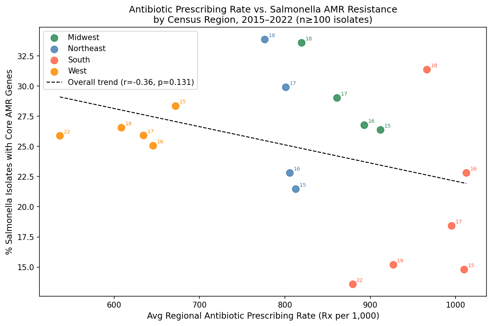
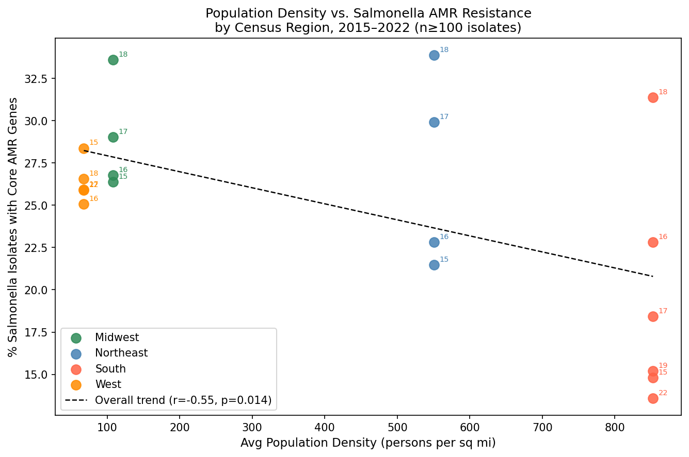
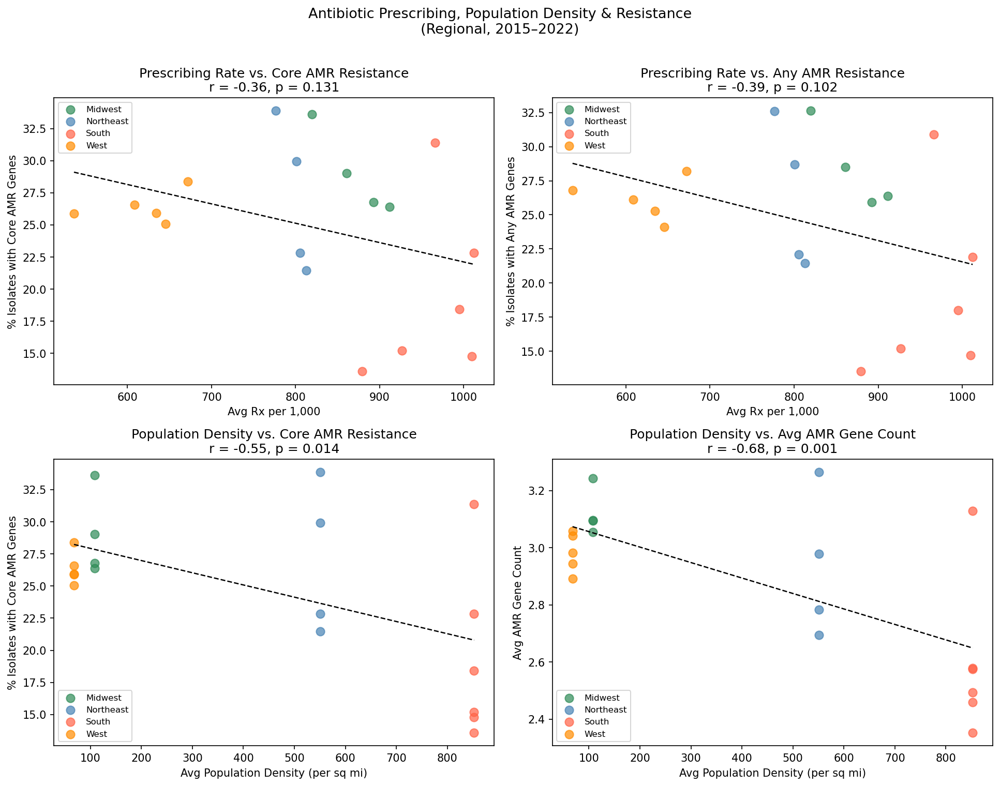

# Does Antibiotic Overuse Drive Drug-Resistant Salmonella?

An exploratory data analysis examining whether US regions that prescribe more antibiotics also harbor more antimicrobial-resistant (AMR) *Salmonella* — and why the answer turns out to be more complicated than expected.

**Tools:** Python · pandas · DuckDB · scikit-learn · matplotlib · SciPy  
**Data:** CDC (prescribing rates) · NCBI Pathogen Detection (232k isolates) · US Census Bureau  
**Period:** 2015–2022 across all 50 states + DC

---

## The Question

Antibiotic resistance is one of the most urgent public health challenges of our time. The intuitive assumption is simple: the more antibiotics we use, the more resistant bacteria become. But does this actually hold at the regional level in the United States?

This project tests that assumption by linking **state-level outpatient antibiotic prescribing rates** (CDC) to **AMR gene prevalence in clinical *Salmonella* isolates** (NCBI Pathogen Detection), controlling for population density and temporal trends across four US Census regions from 2015 to 2022.

> **A note on scope:** Only ~10% of NCBI isolates could be mapped to a Census region (most list only "CDC" as collector with no state detail), so these are preliminary patterns rather than definitive conclusions. The findings point to interesting hypotheses worth investigating with richer geographic data.

---

## Key Findings

### 1. Higher prescribing does not mean more resistance (at the regional level)

The South prescribes antibiotics at nearly twice the rate of the West — yet Southern *Salmonella* isolates consistently showed *lower* rates of core AMR genes than Midwestern or Northeastern isolates, which come from lower-prescribing regions.



The overall cross-region correlation between prescribing rate and AMR is negative and non-significant (r = -0.36, p = 0.131), suggesting regional prescribing volume alone does not predict AMR burden in *Salmonella*.

---

### 2. Population density is a stronger signal — but in a surprising direction

Denser regions (Northeast, South) actually showed *lower* AMR prevalence on average. Population density had a statistically significant negative correlation with core AMR (r = -0.55, p = 0.014), and an even stronger one with average AMR gene count (r = -0.68, p = 0.001).



This counterintuitive pattern likely reflects differences in agricultural intensity, livestock proximity, and healthcare surveillance infrastructure between rural and urban regions. It may also partly reflect a **surveillance bias**: urban areas with denser clinical infrastructure tend to test a broader spectrum of patients, capturing milder cases that would go unsampled in rural settings. This could make urban regions appear to have lower AMR prevalence even if true resistance rates are similar.

---

### 3. Temporal trends dominate within-region patterns

Within the Midwest and Northeast, AMR *rose* sharply from 2015 to 2018 (r > 0.93, p < 0.05) even as antibiotic prescribing *fell* — a clear decoupling. Whatever is driving AMR trends in *Salmonella*, it is not primarily outpatient human antibiotic use in those years.



---

### 4. COVID-19 caused a sharp universal prescribing drop

All four regions saw a sudden decline in antibiotic prescribing in 2020, consistent with fewer in-person medical visits. Southern states showed the smallest relative drop and the fastest partial recovery by 2022, while the West remained furthest below pre-pandemic baseline.

---

## Data Pipeline

Building this dataset required stitching together four heterogeneous sources:

```
CDC reports (2015-2018)  -->  HTML scraping (pd.read_html + regex fallback)
CDC reports (2019)       -->  Local CSV (archive page inaccessible)
CDC reports (2020-2022)  -->  Direct CSV download
--------------------------------------------------------------
                         --> Unified state-year panel (408 rows, 51 states x 8 years)
                                        |
US Census API            -->  2020 state populations --> population density
NCBI Pathogen FTP        -->  232k Salmonella isolates (streamed in 50k-row chunks)
                              filtered: USA, clinical/human, 2015-2022
                              region-mapped via 5-priority geographic lookup
                                        |
                         --> Merged region-year dataset (AMR rates + prescribing + density)
```

One interesting challenge: only ~10% of NCBI isolates could be mapped to a Census region — most list only "CDC" as the collecting institution with no state-level detail. The analysis uses a priority chain (HHS region code > institution name > state abbreviation > geo_loc_name) to recover as many as possible.

---

## Methods

- **Prescribing panel:** 51 states x 8 years with year-over-year change, 3-year rolling mean, pre-COVID baseline (2015-2019), and COVID resilience score
- **AMR indicators:** Core AMR gene presence (clinically acquired; excludes intrinsic *mdsA/mdsB* efflux genes), aggregated to region-year with n >= 100 isolate threshold
- **Statistics:** Pearson correlations, OLS and Ridge regression, leave-one-group-out CV (group = region), within-region stratified analysis

---

## Limitations

- Only ~10% of NCBI isolates are geographically mappable, limiting statistical power
- AMR genotype (gene presence) is not equivalent to clinical phenotypic resistance
- Ecological (region-level) correlations cannot establish individual-level causation
- Outpatient human Rx data does not capture agricultural or veterinary antibiotic use, which is likely a major driver of food-borne pathogen AMR
- **Surveillance intensity bias:** urban regions with denser healthcare infrastructure test more patients, including mild cases — this may inflate apparent AMR prevalence in rural/low-density regions relative to their true burden, and could partly explain the negative population density correlation
- Population density from the 2020 Census is applied uniformly across all study years

---

## Reproducing the Analysis

```bash
git clone https://github.com/schmidtjacob46/salmonella-amr-prescribing
cd salmonella-amr-prescribing
pip install -r requirements.txt
jupyter notebook antibiotic_amr_analysis.ipynb
```

> **Note:** The notebook fetches data live from CDC, NCBI FTP, and the US Census API. A free Census API key is required — obtain one at [api.census.gov/data/key_signup.html](https://api.census.gov/data/key_signup.html) and update the `CENSUS_KEY` variable in Section 5.1.

---

## Repository Structure

```
.
├── antibiotic_amr_analysis.ipynb   # Full analysis notebook
├── 2019_report.csv                 # Local fallback for 2019 CDC data
├── prescribing_vs_resistance.png
├── popdensity_vs_resistance.png
├── resistance_correlations.png
├── requirements.txt
└── README.md
```
